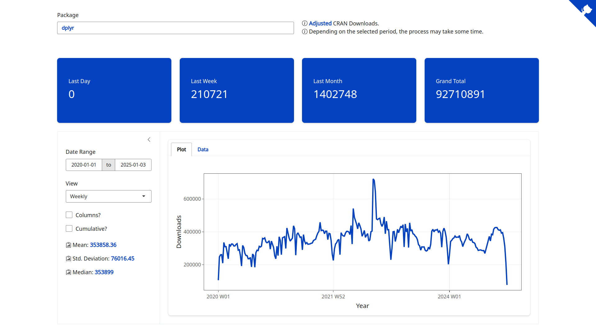

# cran-logs

<!-- badges: start -->

<!-- badges: end -->

## Overview

`cran-logs` is a [Shiny](https://shiny.posit.co/) dashboard for visualizing package download statistics from the Comprehensive R Archive Network ([CRAN](https://cran.r-project.org/)).

The dashboard supports query strings for direct access to specific package statistics. For example: <https://danielvartan.shinyapps.io/cran-logs/?package=dplyr>.

To learn more about Shiny and its features, see Hadley Wickham's [Mastering Shiny](https://mastering-shiny.org) book.

## License

`cran-logs` code is released under the [MIT license](https://opensource.org/license/mit).
