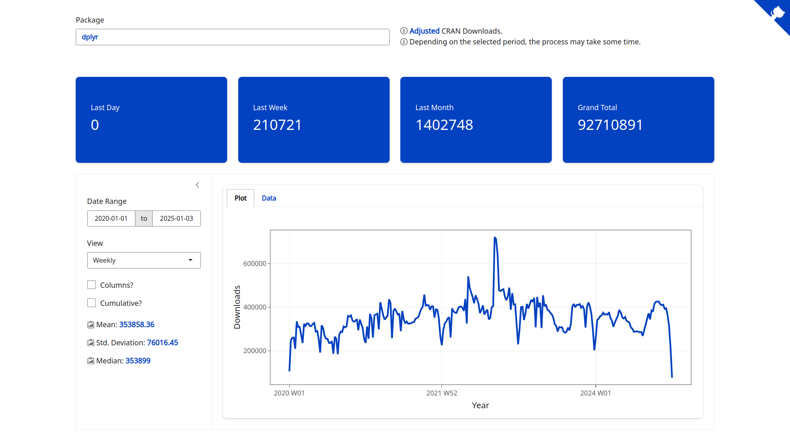

# cran-logs

<!-- badges: start -->
[](https://www.repostatus.org/#active)
[](https://www.gnu.org/licenses/gpl-3.0)
[](https://www.contributor-covenant.org/version/3/0/code_of_conduct/)
<!-- badges: end -->

## Overview

`cran-logs` is a [Shiny](https://shiny.posit.co/) dashboard for visualizing package download statistics from the Comprehensive R Archive Network ([CRAN](https://cran.r-project.org/)).

The dashboard supports query strings for direct access to specific package statistics. For example: <https://danielvartan.shinyapps.io/cran-logs/?package=dplyr>

To learn more about [Shiny](https://shiny.posit.co/) and its features, see Hadley Wickham's book [Mastering Shiny](https://mastering-shiny.org).



## Usage

The dashboard was developed as a [Shiny](https://shiny.posit.co/) app, running inside a [Docker](https://www.docker.com/) container. Data processing is made using the [R](https://www.r-project.org/) programming language. To ensure consistent results, the [`renv`](https://rstudio.github.io/renv/) package was used to manage and restore the R environment.

After installing all the dependencies mentioned above, follow these steps to deploy the dashboard locally:

1. **Clone** this repository to your local machine.
2. **Open** the project in your preferred [IDE](https://en.wikipedia.org/wiki/Integrated_development_environment).
3. **Install package dependencies** by running [`renv::restore()`](https://rstudio.github.io/renv/reference/restore.html) in the R console.
4. **Open** `app.R` and deploy the Shiny app by clicking the "Run App" button in the IDE or running `shiny::runApp()` in the R console.

## Deploying to Google Cloud Run

The dashboard runs as a container. [`Dockerfile`](Dockerfile) builds it from `rocker/r-ver`, restores `renv.lock`, copies the app and the data, and starts Shiny on the port Cloud Run provides.

### 1. Prerequisites

- The [gcloud CLI](https://cloud.google.com/sdk/docs/install), authenticated with `gcloud auth login`.
- A Google Cloud project with billing enabled.
- The `data` folder present locally, since it is not versioned and is copied into the image at build time.

Set the values you will reuse:

`````bash
export PROJECT_ID="your-project-id"
export REGION="us-central1"
export SERVICE="cran-logs"
export REPOSITORY="dashboards"

gcloud config set project "${PROJECT_ID}"

gcloud services enable \
  run.googleapis.com \
  artifactregistry.googleapis.com \
  cloudbuild.googleapis.com
`````

### 2. Build and Push the Image

`````bash
gcloud artifacts repositories create "${REPOSITORY}" \
  --repository-format=docker \
  --location="${REGION}"

export IMAGE="${REGION}-docker.pkg.dev/${PROJECT_ID}/${REPOSITORY}/${SERVICE}:latest"

gcloud builds submit --tag "${IMAGE}"
`````

Two ignore files decide what travels with the build, and they are not interchangeable:

- [`.gcloudignore`](.gcloudignore) controls what `gcloud builds submit` uploads. Without it, `gcloud` falls back to `.gitignore`.
- [`.dockerignore`](.dockerignore) controls what `docker build` copies out of the uploaded context.

The image installs Linux binaries from Posit Package Manager, which link against system libraries.

To build locally instead:

`````bash
docker build -t "${IMAGE}" .
docker push "${IMAGE}"
`````

### 3. Deploy the service

`````bash
gcloud run deploy "${SERVICE}" \
  --image="${IMAGE}" \
  --region="${REGION}" \
  --platform=managed \
  --port=8080 \
  --cpu=2 \
  --memory=8Gi \
  --min-instances=1 \
  --max-instances=4 \
  --concurrency=20 \
  --timeout=3600 \
  --session-affinity
`````

The flags are not arbitrary:

- `--session-affinity` is **required**. Shiny keeps the session state in memory, so a reconnect that lands on another instance loses everything.
- `--timeout=3600` gives the WebSocket the longest lifetime Cloud Run allows. The default of 300 seconds drops idle sessions.
- `--min-instances=1` avoids the cold start. Reading the coverage dataset takes a few seconds, which a first visitor should not have to wait for.
- `--memory=8Gi` covers the datasets kept in memory for the life of the instance. `4Gi` is the practical floor.
- `--concurrency=20` keeps each instance responsive, since every session holds its own reactive state.

### 4. Access

`````bash
gcloud run services add-iam-policy-binding "${SERVICE}" \
  --region="${REGION}" \
  --member="allUsers" \
  --role="roles/run.invoker"
`````

Get the service URL with:

`````bash
gcloud run services describe "${SERVICE}" --region="${REGION}" --format='value(status.url)'
`````

### 5. Updating

Rebuild and redeploy after changing the code or the data:

`````bash
gcloud builds submit --tag "${IMAGE}"
gcloud run deploy "${SERVICE}" --image="${IMAGE}" --region="${REGION}"
`````

Check the logs with:

`````bash
gcloud run services logs read "${SERVICE}" --region="${REGION}" --limit=50
`````

## Contributing

[](https://www.contributor-covenant.org/version/3/0/code_of_conduct/)

Contributions are always welcome! Whether you want to report bugs, suggest new features, or help improve the code or documentation, your input makes a difference.

Before opening a new issue, please check the [issues tab](https://github.com/danielvartan/cran-logs/issues) to see if your topic has already been reported.

## License

[](https://www.gnu.org/licenses/gpl-3.0)

```text
Copyright (C) 2026 Daniel Vartanian

LogoActions is free software: you can redistribute it and/or modify it
under the terms of the GNU General Public License as published by the Free
Software Foundation, either version 3 of the License, or (at your option) any
later version.

This program is distributed in the hope that it will be useful, but WITHOUT ANY
WARRANTY; without even the implied warranty of MERCHANTABILITY or FITNESS FOR A
PARTICULAR PURPOSE. See the GNU General Public License for more details.

You should have received a copy of the GNU General Public License along with
this program. If not, see <https://www.gnu.org/licenses/>.
```
